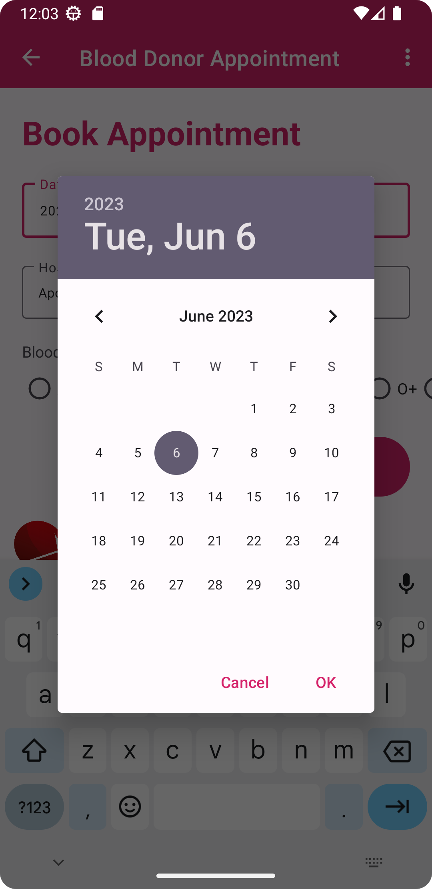
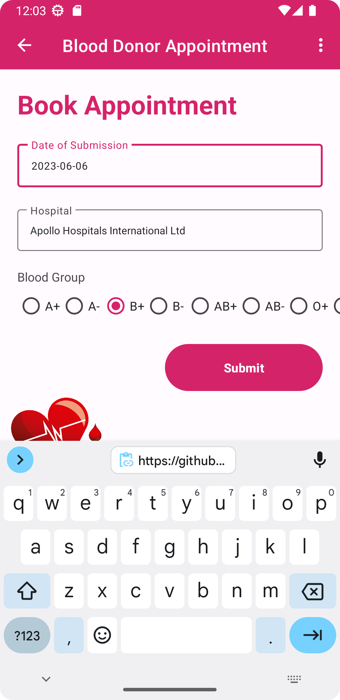

```sql

// create sql user with password
CREATE USER 'user'@'localhost' IDENTIFIED BY 'password';

/* grant all priveleges to user
GRANT ALL PRIVILEGES ON *.* TO 'user'@'localhost';

FLUSH PRIVELEGES;
```


```
create database hospital;

use database hospital;

create table register (username varchar(100) NOT NULL, email varchar(255) NOT NULL, phoneno varchar(20) NOT NULL, password varchar(40) NOT NULL);
```






**References**
[Android Material](https://github.com/material-components/material-components-android/)  
[App Snipp](https://appsnipp.com/category/android/)  
[Blood Donation Images](https://pngtree.com/so/blood-donation)  


