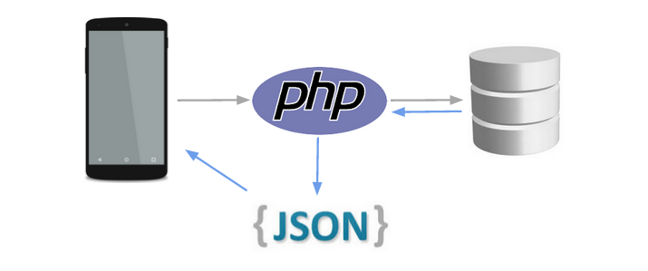

```sql

// create sql user with password
CREATE USER 'user'@'localhost' IDENTIFIED BY 'password';

/* grant all priveleges to user
GRANT ALL PRIVILEGES ON *.* TO 'user'@'localhost';

FLUSH PRIVELEGES;
```


```
create database hospital;

use database hospital;

create table register (username varchar(100) NOT NULL, email varchar(255) NOT NULL, phoneno varchar(20) NOT NULL, password varchar(40) NOT NULL, PRIMARY KEY(email));
```
<div style="display: block;">
    
    
    
    
    
    
    
    
    
    
    
</div>



```

create table hospital(bloodgroup varchar(4), email varchar(255), hospital varchar(1024), FOREIGN KEY(email) REFERENCES register(email));

create table donor (bloodgroup varchar(4), email varchar(255), hospital varchar(1024), dateofsubmit DATE, FOREIGN KEY(email) REFERENCES register(email));

create table receiver (bloodgroup varchar(4), email varchar(255), hospital varchar(1024), dateofreceive DATE, FOREIGN KEY(email) REFERENCES register(email));

```

```
INSERT INTO hospital(bloodgroup, email, hospital) SELECT "A+",email, "Bavishi Eye Hospital" FROM register  WHERE email='kushal@gmail.com';
```


---
Receiver
- for validation
    1. email
    2. password
- userinfo
    1. address
    2. hospital;
    3. date of receive
        - today means emergency
        - not today means not emergency


**References**  
[Android Material](https://github.com/material-components/material-components-android/)  
[App Snipp](https://appsnipp.com/category/android/)  
[Blood Donation Images](https://pngtree.com/so/blood-donation)  


