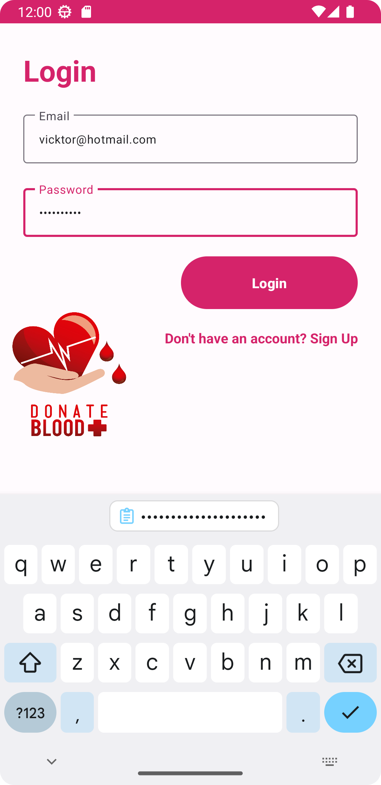
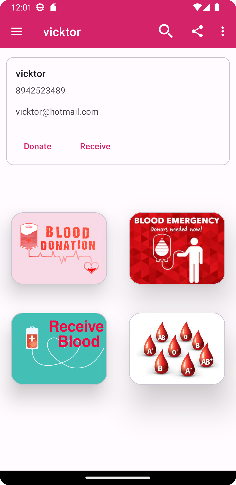
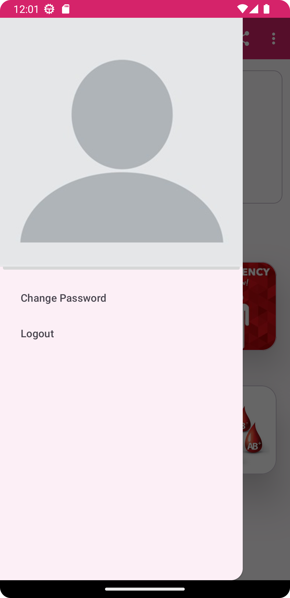
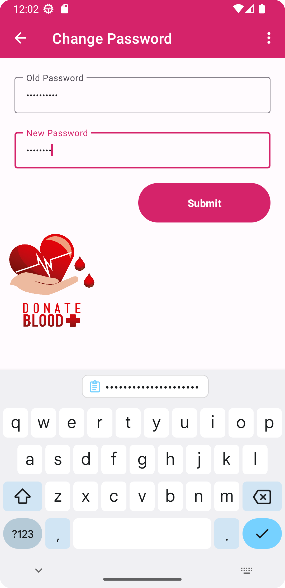

# Front End 
:::::::::::::: {.columns}
::: {.column width="50%"}

:::
::: {.column width="50%"}

:::
::::::::::::::

# Front End
:::::::::::::: {.columns}
::: {.column width="50%"}

:::
::: {.column width="50%"}
- Home Page
    1. Blood Donation
    2. Receive Blood
    3. Blood Emergency
    4. Available Blood Group
:::
::::::::::::::

# Front End
:::::::::::::: {.columns}
::: {.column width="50%"}

:::
::: {.column width="50%"}

:::
::::::::::::::

# Front End
:::::::::::::: {.columns}
::: {.column width="50%"}

:::
::: {.column width="50%"}

:::
::::::::::::::

# Front End
:::::::::::::: {.columns}
::: {.column width="50%"}

:::
::: {.column width="50%"}
- Donor
1. validation  
    email, password
2. userinfo  
    email, hospital, date of submit 
:::
::::::::::::::

# Front End
:::::::::::::: {.columns}
::: {.column width="50%"}

:::
::: {.column width="50%"}
- Receiver
1. validation  
    email, password
2. userinfo  
    email, hospital, date of recieve
    - today means emergency 
    - not today means not emergency  

:::
::::::::::::::

# Front End
:::::::::::::: {.columns}
::: {.column width="50%"}

:::
::: {.column width="50%"}

:::
::::::::::::::

# Working

# Working
- User Input is collected by Java
- Create new thread send query by PHP
- PHP serialize output as JSON
- Result is handled by Main Thread of Java
- Which deserialized JSON result and Displays on Screen
